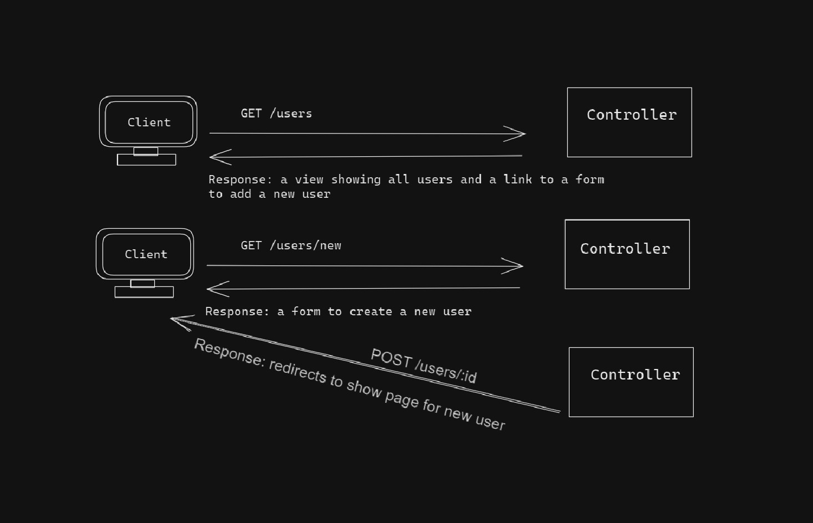
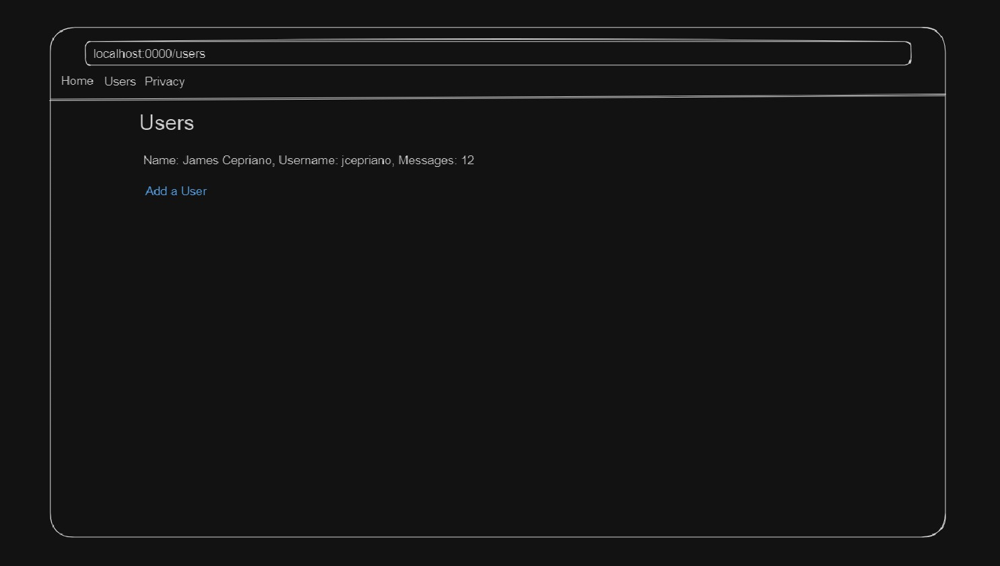
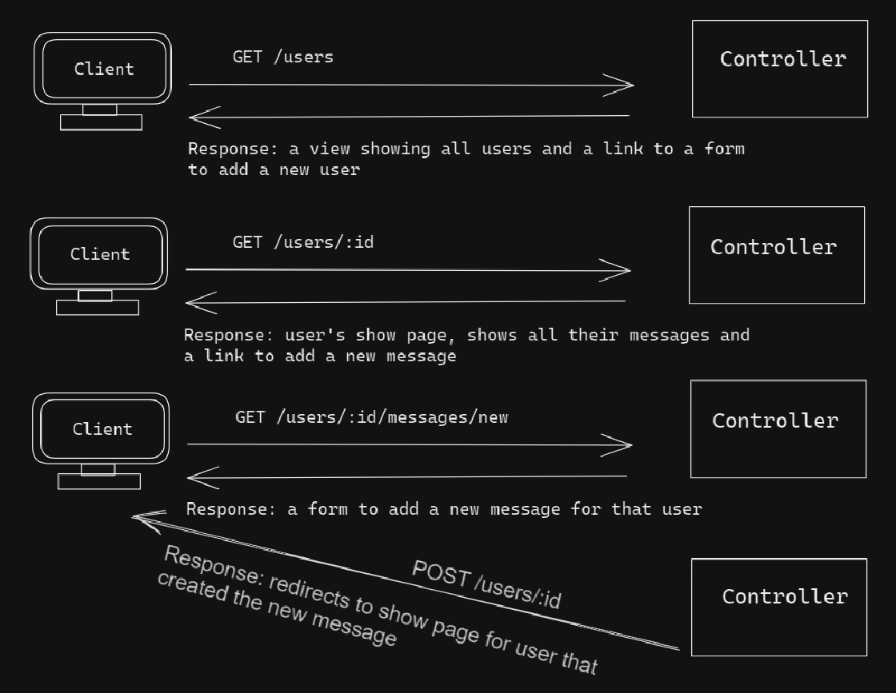
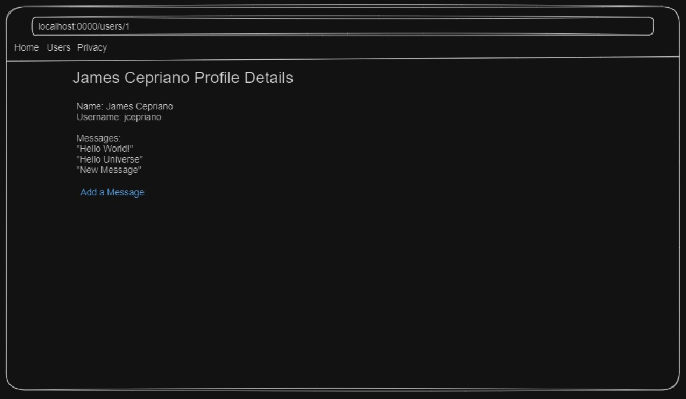

# MvcMessageLogger Planning Assets

## Set Up
- Fork & Clone Repo
- Create the connection string with the appropriate values in the `appsettings.json` file
- Run `Update-Database` in the package manager console

## About
MvcMessageLogger was developed to allow users the ability to write down and track messages within their profile. Users can create their accounts and 
write out messages with a little bit of data for each message.

The time spent working on this application was mostly back-end logic using C#. The front-end was built solely with HTML. There is currently no additional CSS
added to the project. Any and all CSS was generated by Microsoft when the project was first made.

## Contributors
- James Cepriano

<h1>Wireframes</h1>

## Iteration 1 - Creating and Viewing Users

#### 
#### 

## Iteration 2 - "Login" and Create Messages

#### 
#### 

## Tech Stack

